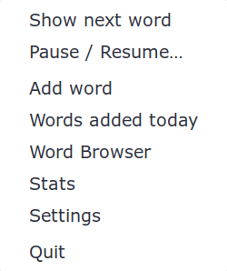
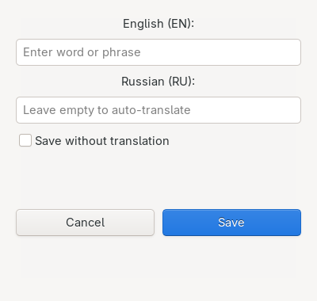
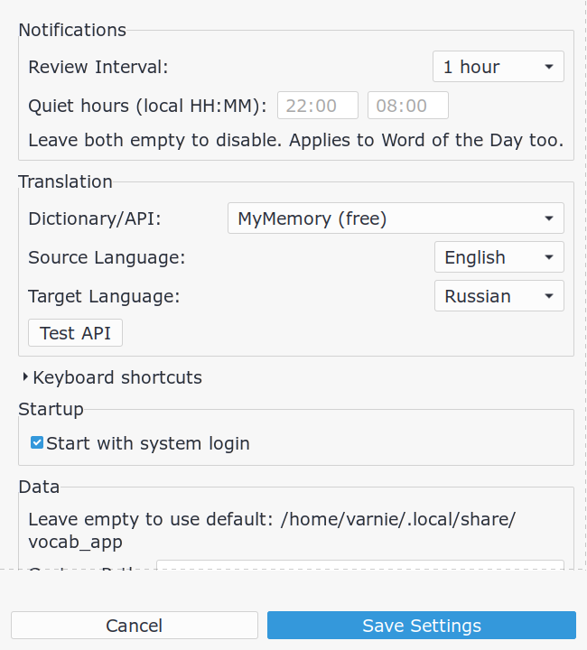
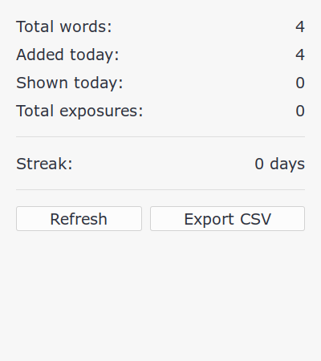
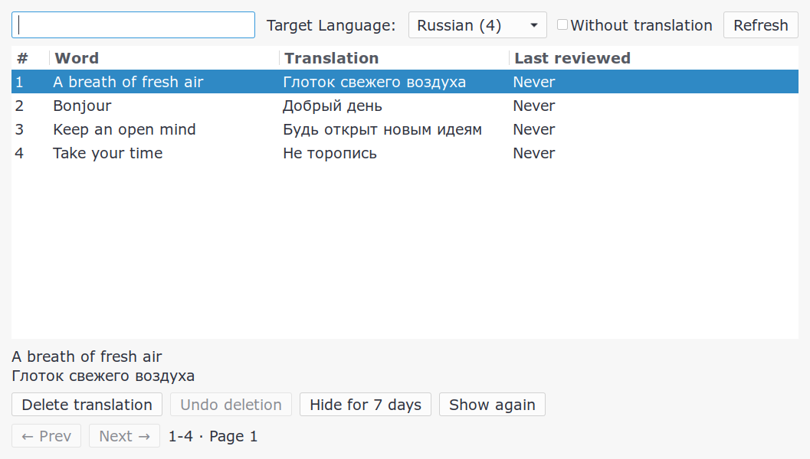

# Vocabulary App

A lightweight vocabulary learning app with system tray and spaced repetition. Supports Linux desktop (XFCE, GNOME, etc.) and macOS with GTK. You control what you learn. Period.

## Features

- **System tray**: Runs in background with tray icon
- **Save phrases**: Select text anywhere, press a hotkey, done
- **Passive word rotation**: Spaced exposures with a limited share of new words; no ratings required
- **Auto-translation**: Automatic translation via multiple providers
- **Multiple translation providers**: Google (direct), Google (deep-translator), MyMemory — with automatic fallback if one is blocked
- **Stats dashboard**: See words learned, streak, reviews today
- **Word Browser**: View, search, edit and delete all words
- **Words Added Today**: Quick view of today's vocabulary
- **Word of the Day**: Daily vocabulary boost with CEFR-level words (A1-C2)
- **Autostart**: Automatically starts on login
- **Multiple languages**: Support for 9 target languages
- **Custom data directory**: Store database anywhere (e.g., Dropbox for sync)
- **Quiet hours and snooze**: Pause automatic notifications until a chosen time, set quiet hours, or hide a word for seven days
- **Responsive editing**: Background translation, preserved spelling, language-specific editing, and undo for the last deleted translation
- **Cross-platform**: Works on Linux and macOS

## Screenshots

Window contents below use demo vocabulary; decorations and theme depend on your desktop.

### System Tray Menu


### Add Word Dialog


### Settings Window


### Statistics Window


### Word Browser


### Popup Translation Message


## GUI App (Recommended)

Located in `src/` folder - modern GTK3 interface with system tray.

### Setup

```bash
./setup.sh
```

This will create a virtual environment and install all dependencies:
- `requests` - HTTP library
- `sqlalchemy` - Database ORM
- `deep-translator` - Translation library
- `pytest` - Testing framework
- `pytest-mock` - Mock support
- `pytest-cov` - Coverage reports

#### Platform-specific dependencies

**Linux (apt):** `python3-gi`, `python3-gi-cairo`, `gir1.2-gtk-3.0`, `gir1.2-appindicator3-0.1`

**Linux (pacman):** `python-gobject`, `gtk3`, `libappindicator-gtk3`

**macOS (Homebrew):** `gtk+3`, `pygobject3`, `adwaita-icon-theme`

### Running

```bash
source venv/bin/activate
python3 src/vocab_gui.py
```

### Keyboard Shortcuts

#### Linux

Configure in your desktop environment settings (usually Settings → Keyboard → Shortcuts):

| Command | Purpose |
|---------|---------|
| `python3 /path/to/src/vocab_cli.py --save` | Save selected text |
| `python3 /path/to/src/vocab_cli.py --delete` | Delete current word |
| `python3 /path/to/src/vocab_cli.py --next` | Show next word |

#### macOS

Configure via System Settings → Keyboard → Shortcuts → Services, or use tools like Hammerspoon or Karabiner-Elements. The same CLI commands apply:

| Command | Purpose |
|---------|---------|
| `python3 /path/to/src/vocab_cli.py --save` | Save clipboard text |
| `python3 /path/to/src/vocab_cli.py --delete` | Delete current word |
| `python3 /path/to/src/vocab_cli.py --next` | Show next word |

### Settings

- **Review interval**: How often the background loop checks for words (30min - 8hours)
- **Translation provider**: Choose between Google Translate (direct), Google Translate (deep-translator), or MyMemory (free). If the selected provider fails, the app automatically falls back to the next working one.
- **Target language**: Translation language (Russian, Spanish, French, German, Italian, Portuguese, Japanese, Chinese, Korean)
- **Word of the Day**: Enable/disable daily word notifications with CEFR level selection (A1-C2)
- **Autostart**: Automatically starts on system login
- **Custom data directory**: Store database elsewhere
- **Quiet hours**: Optional local start/end times (`HH:MM`); an overnight interval such as 22:00–08:00 is supported. Empty or equal endpoints disable quiet hours. Both ordinary exposures and Word of the Day respect them.

### Everyday use

- **Save** uses your entered translation, or translates an empty field. Choose
  **Save without translation** to keep an untranslated entry explicitly.
- Translation runs in the background, with duplicate submissions disabled. Each
  provider runs in an isolated worker with a 15-second deadline; fallback can use
  up to three workers sequentially (approximately 45 seconds in the worst case).
- Existing translations are reused when adding the same phrase again. Double-click
  a browser row and choose **Translate again** to preview a fresh translation before saving.
- Original capitalization is preserved. Duplicate lookup and search are Unicode
  case-insensitive. Existing lowercase entries are retained and can be edited.
- In **Word Browser**, **Without translation** shows words missing a translation
  in the selected language. Empty languages remain selectable. Clearing a translation
  in the edit dialog removes that translation; the phrase stays in the library.
- Column headers sort the entire result, including subsequent pages. The selected
  phrase and translation are shown below the table with wrapping and selectable text.
- **Undo deletion** restores the last translation deleted with the browser's delete
  button while that window remains open. It never overwrites a newer translation.
- **Hide for 7 days** temporarily excludes a word from the exposure queue across
  languages; **Show again** removes that snooze. Neither action records an exposure.
- **Pause / Resume…** chooses the next occurrence of a local time (within 24 hours).
  The pause survives restarts. Resume clears this pause; quiet hours still apply.
- Enter submits the add/edit dialog; Escape closes windows when no save is in progress;
  Ctrl+F focuses browser search. Statistics and today's list refresh on reopening
  and after GUI library changes. Their day boundary follows the local timezone.
- Launching the GUI again opens the existing instance's browser through the desktop
  session bus. Exit an older running version before starting this version.

### Database Location

- **Linux default**: `~/.local/share/vocab_app/vocab.db`
- **macOS default**: `~/Library/Application Support/vocab_app/vocab.db`
- Can be changed in settings

## Passive Word Rotation

After successive exposures, a word becomes eligible again after 4 hours, 1 day,
3 days, 7 days, then 14 days. The interval stays capped at 14 days: notification
history does not prove that a word has been learned. No ratings or responses are required.

The queue prioritizes words by time since exposure relative to their interval,
randomizing exact ties. When due words are available, an unseen word is introduced
only after three other exposures since the previous introduction. If no words are
due, unseen words can fill the slots, oldest additions first. Only words with a
translation in the selected target language are eligible.

The configured notification cadence stays unchanged, including after a long
absence. If nothing is eligible, no word notification is sent. Manual **Next**
also respects the queue and reports the earliest eligibility time when words are
cooling down. This is eligibility, not a promise of an automatic notification at
that instant: cadence and quiet hours still apply. Manual Next remains available
during pauses and quiet hours. Word of the Day uses its own UTC-day schedule.

The queue uses existing history and survives restarts. Startup adds a snooze table
and a covering history index to existing databases; no vocabulary is rewritten.
Exposure history remains shared across translation languages. As before, history
is recorded when a notification is prepared; it cannot confirm that you read it.
History and the last-exposure timestamp are now committed together.

## Troubleshooting

### Linux

#### No popup appears
- Make sure `notify-send` is installed: `sudo apt install libnotify-bin`
- Check that desktop notifications are enabled in your system settings

#### Icons not showing
- If tray icon or popup icon doesn't appear, check file permissions on `icons/` folder

### macOS

#### GTK not found
- Make sure GTK is installed via Homebrew: `brew install gtk+3 pygobject3`
- Ensure the venv was created with `--system-site-packages`

#### No notifications
- Check that notifications are allowed for "Script Editor" in System Settings → Notifications

#### Tray icon not appearing
- GTK StatusIcon may not appear in the macOS menu bar by default. If the tray icon is missing, you can still run the app and interact via notifications and CLI commands.

### General

#### Words don't appear in review
- Words appear only when due; recently shown words may all be cooling down
- Make sure your target language matches the translations you want to review

## Architecture

```
src/
├── application/           # Service layer (business logic)
│   ├── factory.py         # ServiceFactory - creates services with DI
│   ├── export_service.py  # Export use case with injected CSV writer
│   ├── notification_service.py
│   ├── review_scheduler.py  # Background review loop + pause/WOTD
│   ├── review_service.py  # Review scheduling
│   ├── settings_service.py
│   ├── service_interfaces.py  # Abstract interfaces
│   ├── translation_test_service.py
│   ├── vocab_service.py   # Facade over all services
│   ├── word_service.py    # Word CRUD operations
│   └── wotd_service.py    # Word of the Day
│
├── domain/                # Domain layer (pure business rules)
│   ├── entities.py       # Word, Language, Stats, etc.
│   ├── exceptions.py     # TranslationError
│   └── repositories.py  # Abstract repository interfaces
│
├── infrastructure/        # Infrastructure layer (external systems)
│   ├── translation.py    # Translation API implementations
│   ├── models.py         # SQLAlchemy ORM models
│   ├── mappers.py        # ORM ↔ Entity mappers
│   ├── word_source.py    # LocalWordSource (CSV-backed WOTD)
│   └── ...
│
├── repositories/          # Data access implementations
│   ├── base.py           # AbstractDatabase interface
│   ├── language_repository.py
│   ├── settings_repository.py
│   ├── sqlite.py         # SQLite implementation
│   ├── stats_repository.py
│   ├── word_repository.py
│   └── wotd_repository.py
│
├── bootstrap.py          # Composition root and startup initialization
├── vocab_gui.py          # GTK3 GUI entry point
└── vocab_cli.py          # CLI entry point (hotkeys)
```

### Dependency boundaries

`bootstrap.py` is the composition root used by the GUI and CLI. It creates the
SQLite repositories and external adapters, initializes defaults, and injects
them into application services. Importing `application` does not load GTK,
SQLAlchemy, translation clients, or filesystem adapters.

The domain contains entities and repository contracts. Application services
coordinate use cases through those contracts and injected callbacks. Concrete
storage, JSON configuration, current-phrase state, CSV output, translation,
clipboard, notifications, and database relocation live in outer adapters.
Settings keys and defaults remain in the dependency-free `config.py` module.

Review ordering is owned by the repository query, notification review tracking
by `NotificationService`, and settings normalization by the typed settings
getters. All services created by one factory share one settings service.

See [the project-wide architecture review](docs/architecture-review.md) for the
SOLID, Clean Architecture, KISS, and DRY assessment and validation limits.

## Testing

### Run tests

```bash
source venv/bin/activate
pytest
```

### Test structure

```
src/tests/
├── conftest.py           # Fixtures
├── domain/               # Domain entity tests
│   └── test_entities.py
├── integration/          # Integration tests
│   └── test_repository.py
└── unit/                 # Unit tests
    ├── test_application_init.py
    ├── test_config.py
    ├── test_export_service.py
    ├── test_review_service.py
    ├── test_settings_service.py
    ├── test_sqlite.py
    ├── test_version.py
    ├── test_vocab_cli.py
    ├── test_vocab_service.py
    ├── test_word_service.py
    └── test_wotd.py
```

### CI

Tests run automatically on GitHub Actions (see `.github/workflows/test.yml`).

GTK integration tests are opt-in and use a temporary database. On a separate GTK3
Broadway display:

```bash
broadwayd --address=127.0.0.1 :17
# In another terminal:
GDK_BACKEND=broadway BROADWAY_DISPLAY=:17 RUN_GTK_TESTS=1 venv/bin/python -m pytest -q src/tests/integration/test_gui.py
```

Set `UPDATE_SCREENSHOTS=1` on that test command to regenerate the four window
snapshots from demo data. The test display does not connect to your running app.

An opt-in queue benchmark creates 10,000 words and 200,000 exposures in a temporary database:

```bash
RUN_QUEUE_BENCHMARK=1 venv/bin/python -m pytest -q -s src/tests/integration/test_queue_performance.py
```

On the development host, median selection time fell from 1051 ms before the query/index
optimization to 163 ms after it (10 warm measurements). This synthetic benchmark
measures selection only, not translation or notification delivery. The optimization
uses indexed lookups for recent introductions and unseen words, avoiding repeated
full-history aggregation without adding denormalized counters.
